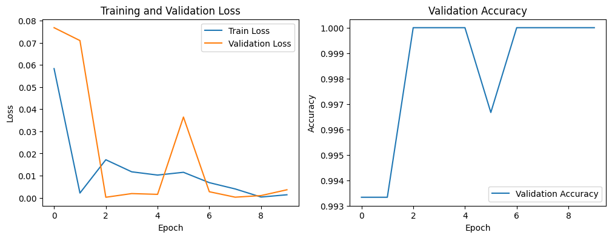

# concrete-crack-detection
[2024-2] 서울여자대학교 딥러닝기반데이터분석 과제2

딥러닝 모델을 활용하여 콘크리트 구조물의 표면 균열 여부를 탐지하는 프로젝트입니다.
이 프로젝트는 토목 구조물의 주요 결함인 콘크리트 표면의 균열을 감지하여 건물의 상태를 평가하고 구조적 안전성 확보를 목표로 합니다.

---

## 프로젝트 개요

- **과제명**: 딥러닝 모델을 활용한 콘크리트 표면 균열 감지
- **수행자**: 데이터사이언스학과 박서진
- **주요 기술 스택**:
  - Python
  - Pytorch
  - FastAPI
- **활용 모델**:
  - MobileNetV2 (시도만 했고 최종 모델로 사용하지 않음)
  - ResNet18 (최종 선택 모델)
 
---

## 데이터셋

### Surface Crack Detection Dataset

- 출처: [Surface Crack Detection Dataset on Kaggle](https://www.kaggle.com/datasets/arunrk7/surface-crack-detection)
- 총 이미지 수: 40,000장
  - Positive (균열 있음): 20,000장
  - Negative (균열 없음): 20,000장
- 이미지 크기: 227 x 227
- 다양한 표면 마감과 조명 조건에서 촬영된 고해상도 이미지

### crack_1000 샘플 데이터

- Kaggle 원본 데이터셋에서 클래스별로 1,000장씩 샘플링하여 사용
- 학습시간을 줄이고 실험 편의성을 높이기 위함
- 폴더 구조:
  ```
  +---crack_1000/
      +---Crawling
          +---positive_1000/   # 균열 있음 이미지 1,000장
          +---negative_1000/   # 균열 없음 이미지 1,000장
  ```

- 본 깃허브에는 이미지 파일이 포함되어 있지 않습니다. 위의 링크의 Kaggle에서 직접 다운로드하여 사용하세요.

---

## 실험 내용 및 결과

### MobileNetV2 실험

- crack_1000 데이터셋으로 학습
- 초기 에폭에서 빠르게 손실 감소, Validation Accuracy가 99% 이상 도달
- 그러나 Validation Loss에서 불안정하고 과적합 발생
- 최종적으로 ResNet18이 더 안정적 성능을 보여 MobileNetV2는 사용하지 않음

#### 학습 그래프



---

### ResNet18 실험

#### 이진 분류용 레이어 수정 모델

- ImageNet 사전 학습 가중치 사용
- 출력 레이어를 이진 분류용으로 수정
- 최종 검증 정확도 약 99%
- 학습과 검증 손실이 안정적으로 감소
- 과적합 없이 높은 정확도 유지


---

#### Conv Layer 및 이진 분류용 레이어 수정 모델

- 첫 번재 Convolution Layer(kernel_size=3, stride=1, padding=1) 세부 조정
- 초기 성능은 매우 우수
- 그러나 8 epoch 이후 검증 손실이 급격히 증가
- 과적합 발생 -> 검증 정확도 약 94%로 하락
- 향후 개선 방안:
  - Early Stopping
  - Regularization 기법 적용


---

### 최종 결론
Conv Layer & 이진 분류용 레이어 수정 모델이 학습 초기에는 빠르게 성능이 향상되었으나, **과적합 문제**로 최종 일반화 성능은 낮아짐. 기존의 이진 분류용 레이어 수정 모델이 더 **안정적인 성능**을 보여줌.

---

## Model Serving (FastAPI 활용)

학습된 ResNet18 모델을 FastAPI를 이용해 서빙합니다.

---

### 1. 모델 서빙 구조

- 구성 요소:
  - Google Drive
  - Google Colab
  - FastAPI
  - ngrok (HTTP 터널링)

서빙 구조는 아래와 같습니다:


---

### 2. 모델 서빙 과정

1. Fine-tuned ResNet18 모델 가중치 로드
2. Crack 이미지 파일 로드
3. ResNet18 모델을 통해 Crack 여부(P/N) 예측
4. 예측 결과를 HTTP Response로 사용자에게 반환

---

### 3. FastAPI 엔드포인트

- '/imageai' 엔드포인트
  - 이미지 파일과 이름을 HTTP 요청으로 받아 처리
  - 모델이 예측한 결과를 JSON 형식으로 반환
    예)
    '''
    {
    "result": "이미지 인식 결과: 00623.jpg --> positive"
    }
    '''
  - 사용자 요청 흐름
    - 구글 드라이브의 이미지 이름 전달
    - FastAPI 서버가 이미지를 불러와 예측
    - positive/negative 결과를 반환

---

### 4. FastAPI 실행 및 데모 영상

아래 GIF는 Google Colab 환경에서 ngrok를 이용해 FastAPI 서버를 실행하고,  
사용자가 Crack 이미지 경로로 요청을 보내면 모델이 균열 여부를 예측해 응답하는 전체 과정을 보여줍니다.


